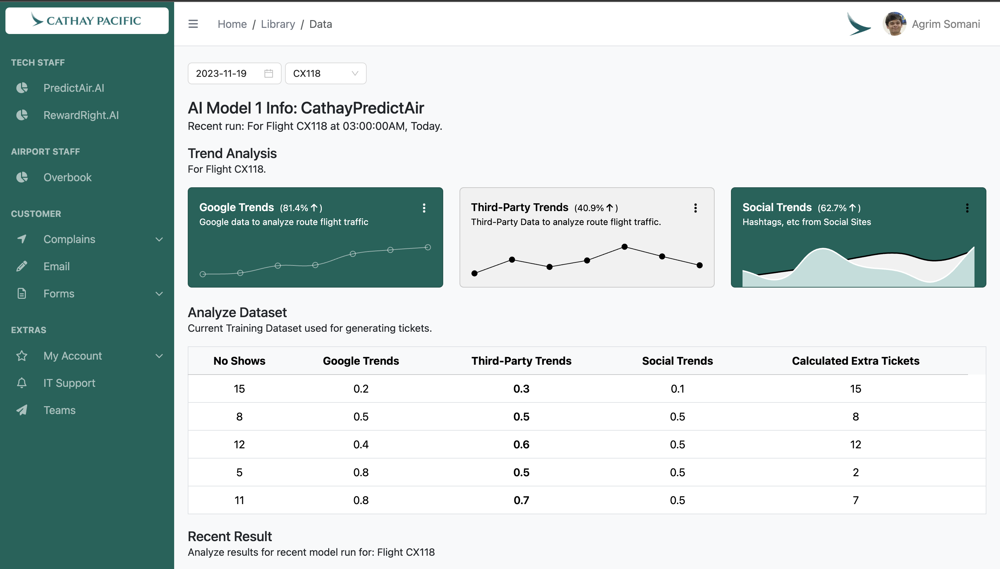
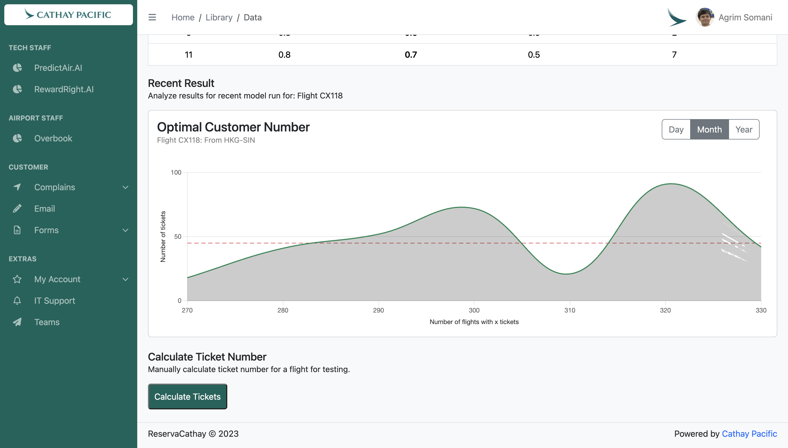
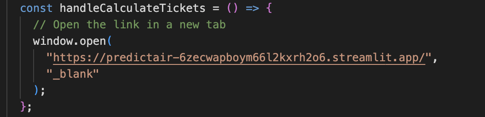
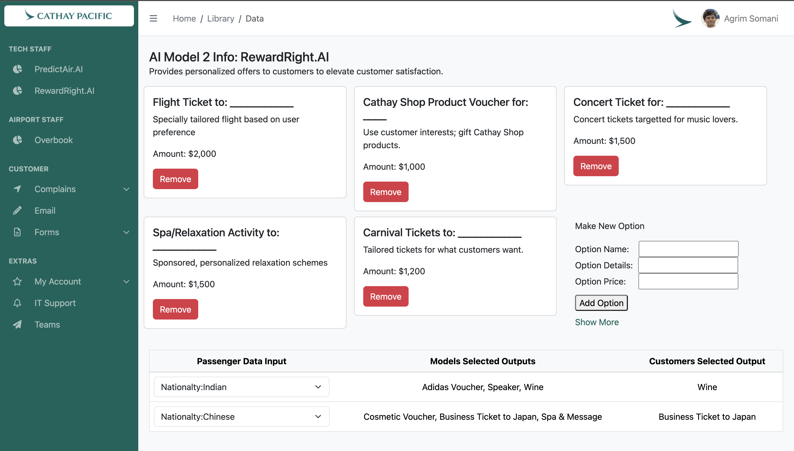
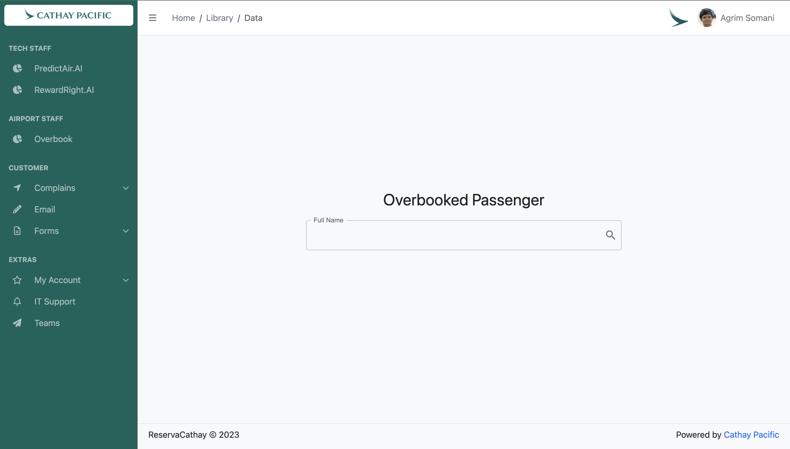
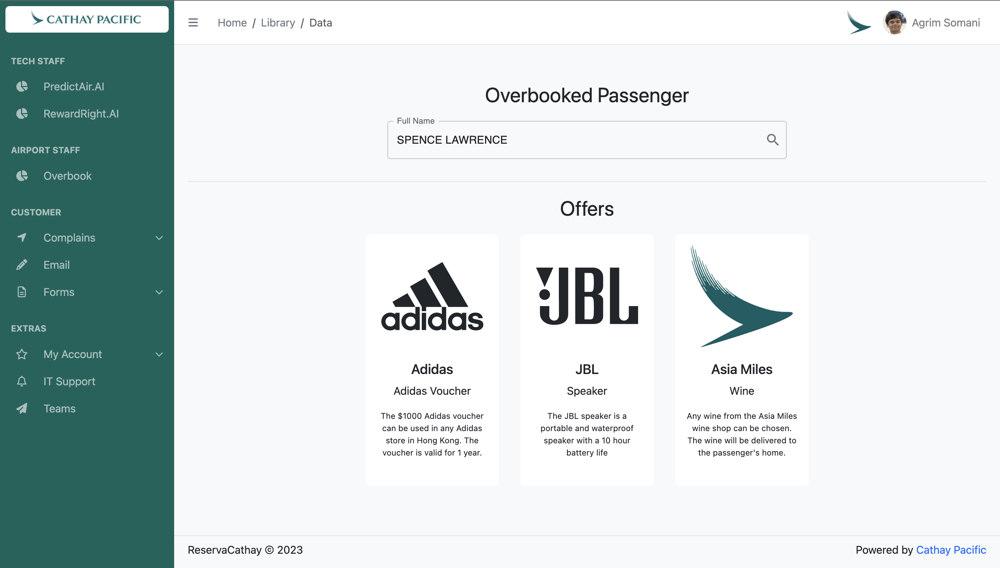

# ReservaCathay 


## How to Install the Staff Application
1. Go to reserva-cathay folder 
```bash
cd reserva-cathay
```
2. Install all the dependencies
```bash
npm install
```
3. Start the project
```bash
npm run dev
```
## Technical Staff
### Model 1: PredictAir.AI
   

  PredictAir.AI predicts the right number of seats to overbook for a flight not only based on historical data, but also Google Trends, 3rd Party Trends, and Social Media Trends. All the data is fed into a trained model which computes the optimal number of tickets to allocated to a flight.
  
  

  We have implemented the Computation Feature from the model in a Steamlit application present at the link here: <a href="https://predictair-6zecwapboym66l2kxrh2o6.streamlit.app/" target="_blank">Link</a>
  

### Model 2: RewardRight.AI


  RewardRight.AI personalizes the compensation provided to overbooked passengers to reduce customer dissatisfaction by grouping factors such as nationality, age, purpose of trips to web-scrape more information about users from similar user patterns online. These are used to identify common trends for that demographic of people.  This data, including data already present from Cathay website on the passenger, and the current available user options, will be fed into our own GPT model for determining the best-personalized compensation offers that the flyer will be most pleased to receive.
  
## Airport Staff


### Overbooked
  Airport Staff will input the name of the overbooked passenger and it will call Model 2 to provide 3 personalized offers, and let the customer choose 1. This data will be fed back into the system as well as the system will monitor if the user rebooks with Cathay to adjust the model and the options in the future to identify the best compensation offers to maximize customer satisfaction.
